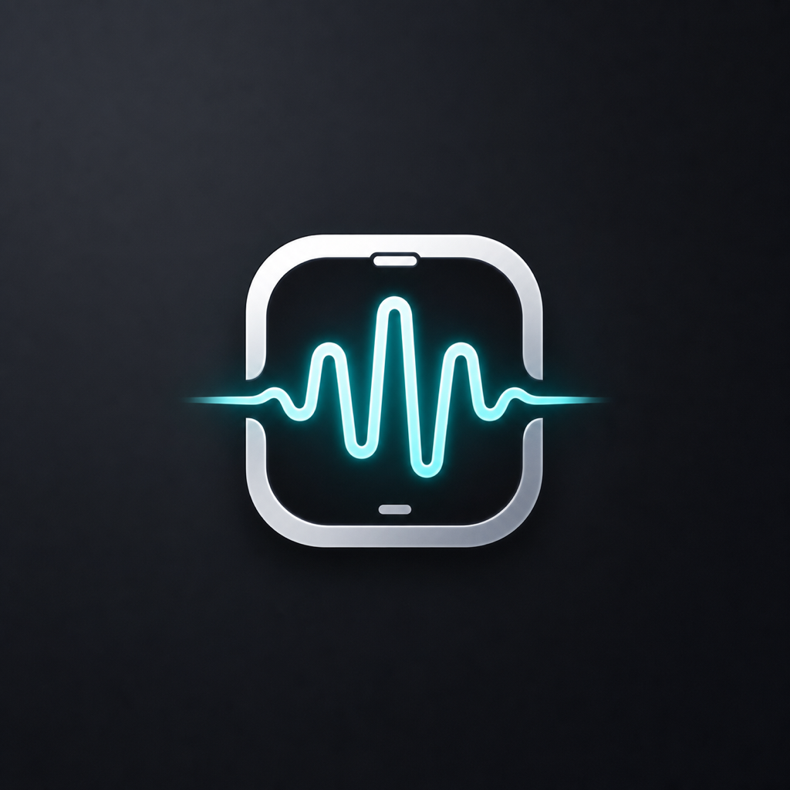
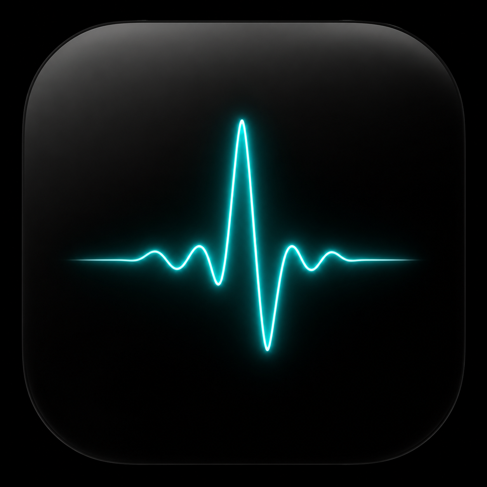

# Loqi

[English](README.md) | [简体中文](README.zh-Hans.md)

<p align="center">
  
</p>

<p align="center">
  
  &nbsp;&nbsp;
  
</p>

完全在 **iPhone 本机**运行的私密语音笔记、转录和总结工具。设置完成后不需要服务器，也不需要联网。实时翻译可以作为可选视图开启。

- **主线流程：** 录音 -> 实时转录（含说话人）-> 即时总结 -> 可搜索归档。如果源语言和目标语言相同，Loqi 就是纯录音/转录工具；如果两者不同，会同时显示实时翻译。
- **语言（v1）：** 中文 ↔ 英文 ↔ 日文（+ 韩文）。
- **工作方式：** 语音先实时转录，然后本机 LLM（Qwen3.5-2B via MLX，约 1.75 GB）在录音过程中把对话整理成提纲笔记，并在停止录音时写出总结。转录文本本身不会被 LLM 重写，只有确定性的热词修正（以及总结时严格限定范围的词汇恢复）会改动它。翻译时，系统 Translation 框架先给出即时草稿，LLM 再用上下文悄悄升级翻译。
- **两种识别引擎**（设置 -> 语音识别）：Apple `SpeechAnalyzer`（即时、逐字输出、无需下载）或基于 sherpa-onnx 的 **SenseVoice-small**（约 230 MB，中/日/韩/英准确率更高，字幕约 1 秒一批更新）。模型可从 ModelScope 魔搭（默认）或 Hugging Face 下载。SenseVoice 框架：生成项目之前，仅在 `ThirdParty/sherpa-onnx` 缺失或过期时运行 `Scripts/fetch-sherpa-onnx.sh`。
- **高准确率二次识别（可选）：** 下载 **Qwen3-ASR-0.6B**（设置 -> 高准确率重新转录，约 990 MB，HF 或 ModelScope）后，“重新转录并总结”和导入会自动使用它。这是 Speech-LLM（Whisper 风格编码器 -> Qwen3 解码器，52 种语言），比实时识别慢，但准确率明显更高，并会使用你的词汇热词作为提示（SenseVoice 做不到这一点）。实时字幕仍使用快速引擎。
- **音频录制：** 每次会话都会保留音频（AAC in crash-tolerant CAF container，约 14 MB/小时），可在会话详情中播放，也可在设置中关闭。如果 app 在录音中被杀死（崩溃、内存压力），下次启动会恢复该会话，包括崩溃前的转录、笔记和音频，并明确提示。
- **实时总结映射：** 录音时，沉默间隙会生成分段笔记，所以长会议结束后的“总结”几乎是即时的；录音中也可以查看“目前总结”。
- **说话人分离：** 实时录音在选择 Auto 或 2-4 人时使用 FluidAudio Streaming Sortformer（约 80 MB，Hugging Face/HF-Mirror，最多 4 个声道槽位）；它会在音频流入时打说话人标签，并且身份只在当前会话内保留，不保存 voiceprint。导入、说话人分离重试，以及已下载模型的新录音后处理使用 FluidAudio 的离线 Pyannote Community-1/VBx 流水线，对整段文件分析，支持 Auto 或 2-6 人。可以随时重命名说话人。
- **麦克风拾音预设：** 近讲 / 均衡 / 会议室会调整采集增益和两个引擎的语音活动检测。可在录音栏中随时切换。会议室模式更适合桌子对面的说话人；近讲模式会更主动过滤背景人声。
- **导入：** 从语音备忘录（或任意音频文件）分享录音，即可得到同样的转录、说话人和总结处理。
- **照片附件：** 录音中可以拍摄幻灯片/白板（录音栏的相机按钮，拍照路径不会打断麦克风），也可以给已保存会话补充照片。本机 Vision OCR（中/日/韩/英）会把提取的文字提供给总结、聊天答案和搜索；缩略图会嵌入转录流。Qwen3.5 原生多模态，所以照片还会由默认模型生成 LLM 描述（图表也不只是 OCR 文本），不需要单独的视觉模型层。
- **搜索：** Sessions 标签页会搜索全部转录、总结、说话人名称、会话标题和照片文字（支持 CJK）；结果可跳到匹配行。
- **点击回放：** 在已保存会话中点击任意转录行，即可播放对应时间点（中断之后偏移仍保持准确）。
- **标题与字幕导出：** 会话会在总结后自动生成标题（可随时重命名）；支持导出 Markdown、SRT（单语或双语）和 WebVTT。
- **与会话聊天：** 对已保存会话提问（例如“有哪些行动项？”），答案完全基于本机笔记和转录生成，并使用你的提问语言回答。
- **低摩擦采集：** 锁屏后录音继续（LLM 工作暂停，回到前台后追赶）；Live Activity / Dynamic Island 显示计时并提供停止按钮；可通过 Siri（“Start recording with Loqi”）、Action Button 或 Control Center 开关开始/停止。
- **热词：** 用户定义的人名和术语（设置 -> 词汇）会影响 ASR 识别，近似错误会被修正（Levenshtein / 拼音匹配），并引导 LLM 保持一致写法。
- **模型下载：** 语音/LLM 模型可使用 Hugging Face 或 ModelScope 魔搭（在设置里选择；如果 huggingface.co 不可达，使用 ModelScope）。说话人识别使用 Hugging Face/HF-Mirror，因为 FluidAudio diarizer 不在 ModelScope 上。模型层级：Qwen3.5-2B（默认，约 1.75 GB）· Qwen3.5-0.8B（最快，约 650 MB）。两者都是原生多模态（文本 + 照片），旧的 Qwen3 文本/VL 层级已经移除。mlx-swift-lm 3.31.3 中有一个 repetition-penalty bug，会让经由 VLM factory 的生成崩溃（2-D prompt 破坏 TokenRing）；`LLMService` 已在本地绕过。依赖版本高于 3.31.3 后可移除该 wrapper。

**要求：** 一台装有 Xcode 26 的 Mac、iPhone 15 或更新机型、iOS 26+，并在手机上开启 Developer Mode。LLM **不能**在模拟器中运行，完整流水线需要真机。

## 开发者预览版

Loqi 目前是 **仅源码开发者预览版**。还没有 TestFlight/App Store 构建，GitHub 也不托管可直接安装的 iPhone app。支持的安装路径是：克隆仓库，生成/打开 Xcode 项目，设置你自己的签名团队，然后在真机 iPhone 上运行。

免费 Apple ID 可以签名本地开发构建，但安装后的构建可能 7 天后过期。小组件和 Control Center 开关使用 app group；如果免费团队无法配置该 entitlement，核心 app 仍可运行，但这些入口可能显示过期状态。TestFlight/App Store 分发需要付费 Apple Developer Program 会员资格，不属于当前预览版范围。

## 开始使用（第一次做 iOS？从这里开始）

1. **安装 Xcode 26**（从 Mac App Store 安装，体积很大，约 10GB+）。首次启动一次，让它安装必要工具。
2. **必要时刷新 Xcode 项目。** 本仓库使用 [XcodeGen](https://github.com/yonaskolb/XcodeGen)：`project.yml` 是事实来源，`Loqi.xcodeproj` 是为方便提交的输出。改动 target、package、build setting 或 entitlement 后需要重新生成。sherpa-onnx 框架已放在 `ThirdParty/`；仅当它们缺失或过期时运行 fetch 脚本。
   ```sh
   brew install xcodegen
   cd ~/Desktop/Loqi
   Scripts/fetch-sherpa-onnx.sh   # 仅当 ThirdParty/sherpa-onnx 缺失或过期时运行
   xcodegen generate
   open Loqi.xcodeproj
   ```
3. **设置签名。** 在 Xcode 中：点击蓝色 *Loqi* 项目图标 -> *Signing & Capabilities* -> 勾选 *Automatically manage signing* 并选择你的团队（你的 Apple ID；可在 Xcode -> Settings -> Accounts 中添加），对 *LoqiWidgets* target 也做同样设置。免费 Apple ID 可用于本地开发签名，但安装后的构建可能 7 天后过期。注意：免费团队有时无法为两个 target 共用的 app group 做 provisioning；除了 Control Center 开关可能显示旧状态，其他功能仍可运行。
4. **准备 iPhone。** 插上手机，在手机上点 *Trust*，并开启 **Developer Mode**（Settings -> Privacy & Security -> Developer Mode，然后重启）。
5. **运行。** 在 Xcode 顶部选择你的 iPhone 作为运行目标，然后按 ⌘R。

首次启动会引导麦克风权限，并下载语音模型。LLM（约 1.75 GB）**只会在你主动请求时下载**：通过设置 -> “Download model now”，或第一次使用 AI 功能（总结、聊天、建议）时出现的同意提示。请在 Wi-Fi 下操作，并选择 Hugging Face 或 ModelScope 作为来源。在下载完成前，app 仍能正常转录和录音，并会用状态胶囊提示你去设置。

## 发布

目前 GitHub Releases 只包含源码标签和变更日志，不提供已签名的 `.ipa` 下载。除非是面向已知注册设备的 ad hoc 构建，否则不要附加 `.ipa`。

## 项目结构

```
Loqi/
├── LoqiApp.swift            App 入口；标签页与翻译宿主栈
├── Features/                SwiftUI 界面
│   ├── Captions/            Record 标签页：实时转录与控制
│   ├── Sessions/            归档、导入、播放、总结、聊天
│   ├── Onboarding/          权限与模型下载流程
│   ├── Settings/            模型选择、录音开关、诊断
│   └── Shared/              状态栏、麦克风按钮、字幕行
├── Intents/                 Siri、Shortcuts、Action Button、小组件 intents
├── Pipeline/
│   ├── Audio/               麦克风采集 -> AsyncStream；CAF/AAC 录音器
│   ├── ASR/                 Apple SpeechAnalyzer、SenseVoice、Qwen3-ASR
│   ├── Translation/         第一层：系统 Translation 框架
│   ├── Refinement/          第二层：MLX LLM 队列与 prompt builder
│   ├── Summary/             Map-reduce 总结；live chunker 与 note queue
│   ├── Speaker/             实时 Sortformer + 离线 Pyannote/VBx 说话人分离
│   ├── Vision/              Vision OCR + Qwen3.5 图像描述
│   └── Import/              音频文件转录（语音备忘录分享）
├── Models/                  CaptionEntry、SessionRecord、AppLanguage
├── Shared/                  Live Activity attributes + app-group state
└── Support/                 CaptionPipeline、CaptionStore、SessionArchive、
                             HotwordStore、ModelCatalog、导出/搜索 helpers
LoqiWidgets/                 Live Activity UI + Control Center / 锁屏开关
LoqiTests/                   Swift Testing 逻辑测试
LoqiUITests/                 Onboarding smoke tests
LoqiMac/                     可构建的 Mac target，不是 v1 发布面
project.yml                  XcodeGen manifest；重新生成前先改这里
```

### 架构概览

`CaptionPipeline` 负责把所有东西串起来：`AudioCaptureService` 读取麦克风，并把 buffer 分发给当前实时 ASR 引擎（Apple `SpeechAnalyzer` 或 SenseVoice）、Streaming Sortformer 说话人分离和 `SessionRecorder`（AAC-in-CAF，用于崩溃容错）。`TranscriptSegmenter` 决定哪些内容值得保留；`LiveChunker` 把最终转录行聚成 chunk，`ChunkNoteQueue` 在沉默间隙生成笔记；当源语言和目标语言不同时，`RefinementQueue` 会升级 `TranslationCoordinator` 的即时翻译草稿（转录文本本身不会被 LLM 重写）。`SummaryJobCenter` 负责后处理导入、Qwen3-ASR 重新转录、离线说话人重试/后处理和总结任务，避免导航造成重复执行。`LLMService` 是唯一直接接触 MLX 的文件；实时工作使用固定的 0.8B 层级，总结/聊天/标题/词汇工作使用所选总结层级，所有 LLM 消费者都会让路给实时语音。所有状态落在 `CaptionStore`，由 UI 渲染；停止录音时，`SessionArchive` 会把转录、音频文件名、附件、聊天历史和实时笔记作为一个 record 保存。`ThermalMonitor` 的降载顺序是：先停 LLM 工作，再卸载 LLM 本身，永远不先牺牲 ASR。

## 验证里程碑

代码库已经完整，但如果你在学习 iOS，建议按这个顺序验证（每一步都可独立测试）：

| # | 验证内容 | 方法 |
|---|---|---|
| 0 | App 能在 iPhone 上构建并运行 | ⌘R，看到 onboarding 页面 |
| 1 | 麦克风 + 电平条 | 开始会话；说话时电平条有反应 |
| 2 | 实时转录 | 说英文；约 300ms 出字并自动修正。再试中文和日文 |
| 3 | 同语言会话 | 中文 -> 中文：只有转录，没有翻译 UI |
| 4 | 翻译视图 | EN -> ZH 字幕实时更新；ZH ↔ JA 可能自动经由英文中转 |
| 5 | LLM 加载 | 设置 -> Download model now；看到 “Model state: Ready”；记录 tok/s 体感 |
| 6 | 停止 -> 归档 | 会话出现在 Sessions 中，录音可播放；长会话总结几乎即时 |
| 7 | 说话人 | 选择 Auto 或 2 人；说话人模型就绪后出现彩色分组；重命名可用 |
| 8 | 热稳定性 | 在较热环境录 30 分钟；app 应降载 LLM，而不是死掉 |

## 真实状态

Latest docs scan: 2026-06-20。本仓库是 iOS-first Swift 6 / XcodeGen app，包含 widget extension、可构建但未发布的 Mac target、较广的 Swift Testing 逻辑测试，以及 onboarding UI smoke tests。本次 README 更新没有重新运行 Xcode 构建或真机验证；[todo.md](todo.md) 中旧的绿色构建记录只是历史证据，不代表当前已验证。剩余开放项见 [ISSUES.md](ISSUES.md) 和 [todo.md](todo.md)：大型导入和照片处理仍可能卡 UI，Swift concurrency / plist warning 清理仍待做，多模态 Qwen3.5 默认模型、崩溃恢复和热行为仍需要一次真机验证。

## v1 不包含（刻意如此）

双向口译模式和 TTS 输出（在转向 capture-first 后移除，Apple 已在系统层商品化实时口译）· 受支持的 Mac / 桌面 app（iPhone app 是 v1 重点；现有 Mac target 不是发布面）· 自动语音语言检测 · 永久在线环境监听（明确开始的会话会继续在后台录制）· 中/英/日/韩以外语言。扩展点已经存在，见 `AppLanguage` 和 `CaptionPipeline.handle` 中的方向解析步骤。
